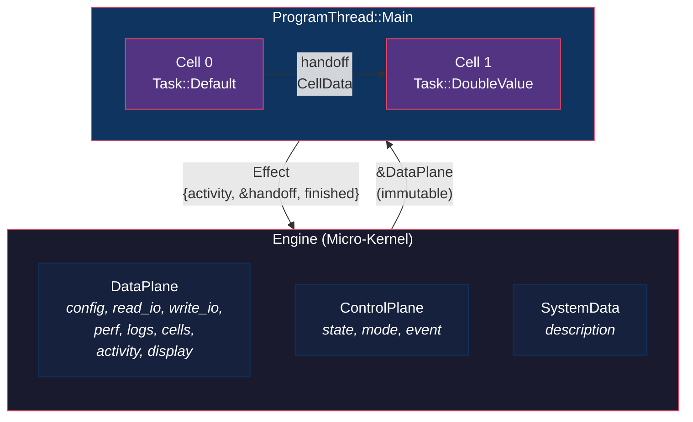
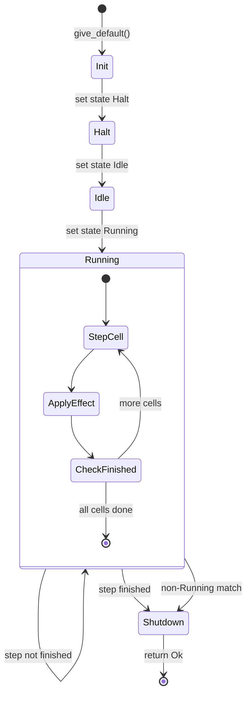
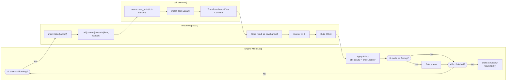
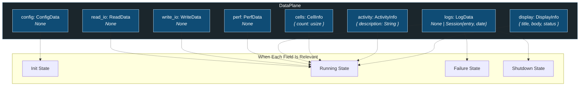
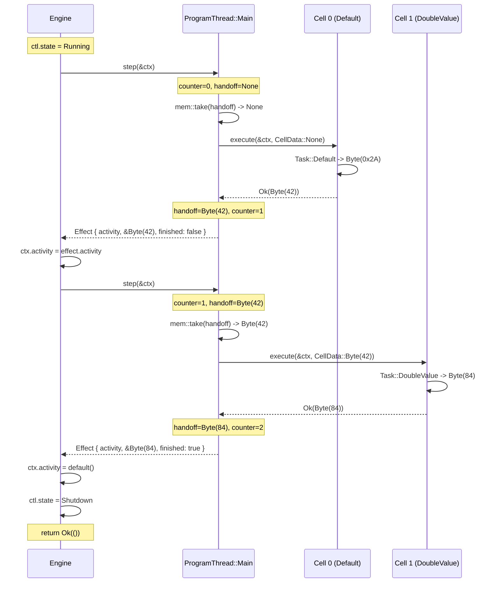
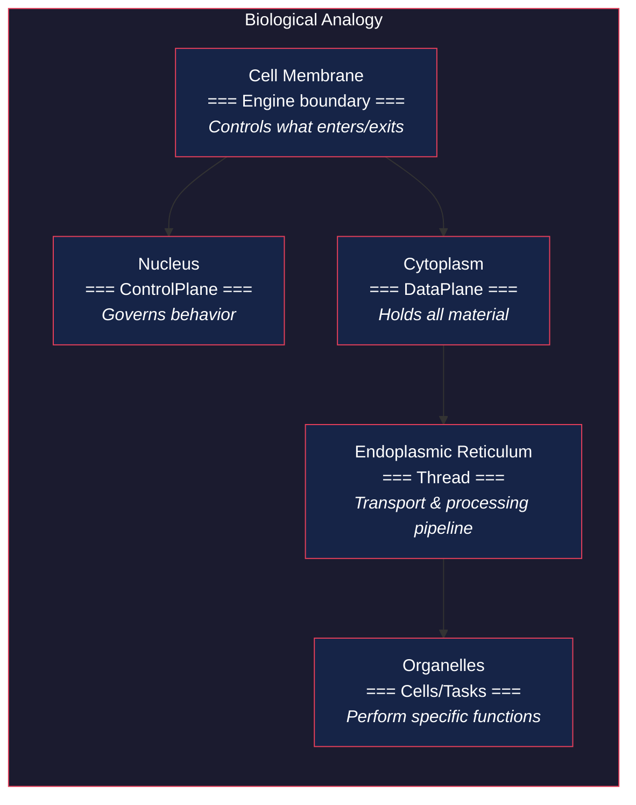
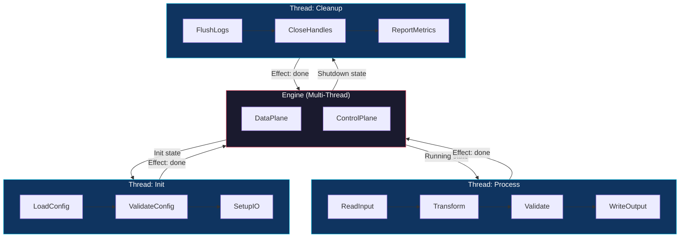
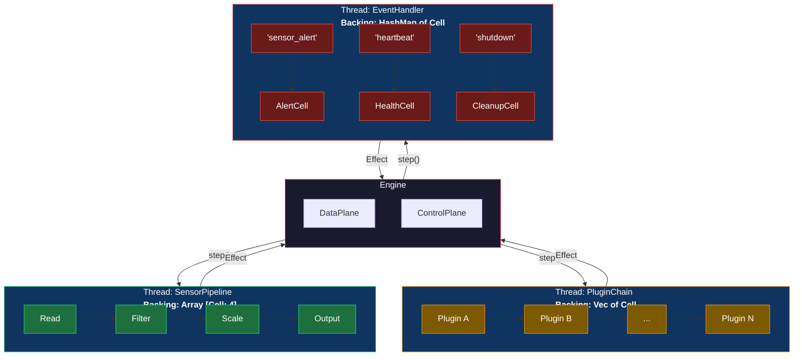

# Regulated Cell Architecture (RCA) - Full Analysis

**Author of Analysis:** Generated from source
**Architecture Author:** Gavin Walters
**Date:** 2026-03-28
**Source Language:** Rust (edition 2024)
**Status:** Stable framework, actively used as a drop-in architecture for production projects

---

## Table of Contents

1. [What is RCA?](#1-what-is-rca)
2. [Core Concepts](#2-core-concepts)
3. [Architecture Deep Dive](#3-architecture-deep-dive)
4. [Data Flow Analysis](#4-data-flow-analysis)
5. [Component Reference](#5-component-reference)
6. [How to Use RCA](#6-how-to-use-rca)
7. [Value Proposition](#7-value-proposition)
8. [Cross-Language Portability](#8-cross-language-portability)
9. [Architecture Diagrams](#9-architecture-diagrams)
10. [Design Patterns & Principles](#10-design-patterns--principles)
11. [Comparison to Other Architectures](#11-comparison-to-other-architectures)

---

## 1. What is RCA?

Regulated Cell Architecture (RCA) is a **structured execution model** for building software systems as deterministic, composable pipelines of regulated transformations. It is not a library you call into -- it is a **skeleton you build on top of**. You drop the framework into a project, define your data shapes, wire up your cells (units of work), and the engine drives execution through a regulated loop.

The core philosophy:

> Systems should not be written -- they should be composed, regulated, and observed.

RCA enforces a separation between **what the system knows** (Data Plane), **how the system behaves** (Control Plane), and **what the system does** (Cells executing within Threads, orchestrated by the Engine). This three-way separation eliminates hidden state, implicit control flow, and tangled logic -- the most common sources of bugs in complex systems.

### Design Origins

RCA emerged from professional embedded software engineering. The array-backed fixed pipelines, explicit state machines, const-sized structures, and no-hidden-allocation philosophy are all hallmarks of **embedded thinking applied to general software architecture**. Embedded constraints force you to get the fundamentals right in ways that higher-level domains let you avoid — and then pay for later. RCA captures those fundamentals as a portable framework.

### Development Methodology

This repository represents a **stable baseline**. The framework is refined through an evidence-based cycle: the baseline is dropped into real projects, practical application reveals what needs to evolve, and only changes backed by concrete evidence from use are folded back into the framework. This is deliberate — speculative generalization is avoided in favor of proven refinement.

### What RCA is NOT

- It is **not** a web framework or application framework in the traditional sense
- It is **not** an actor system (though it shares some ancestry)
- It is **not** a task scheduler or async runtime
- It **is** a deterministic, single-threaded (by default), synchronous execution model that can be extended

---

## 2. Core Concepts

### 2.1 The Five Primitives

| Primitive | Role | Analogy |
|-----------|------|---------|
| **DataPlane** | All system state -- inputs, outputs, config, logs, perf, display | The "memory" of the system |
| **ControlPlane** | Execution governance -- state machine, mode, events | The "nervous system" |
| **Cell** | A unit of work that reads context and produces a transformation | A "function with a contract" |
| **Thread** | An ordered pipeline of cells with a handoff chain | A "conveyor belt" |
| **Engine** | The runtime loop that orchestrates threads and applies effects | The "heartbeat" |

### 2.2 The Fundamental Equation

```
Context = DataPlane + ControlPlane
```

Every cell receives the full context (read-only) and a **handoff** value from the previous cell. It produces a new handoff value. Only the Engine may mutate the DataPlane or ControlPlane based on the **Effect** returned by a thread step.

### 2.3 Ownership Model

```
Engine OWNS DataPlane, ControlPlane, SystemData
  Engine CREATES Thread(s)
    Thread OWNS Cell[], handoff, counter
      Cell HAS-A Task
        Task READS DataPlane (immutable borrow)
        Task RECEIVES handoff (owned transfer)
        Task RETURNS CellData (new handoff)
```

This ownership chain enforces a critical invariant: **cells cannot mutate system state**. They can only produce output. The engine alone decides what to do with that output.

---

## 3. Architecture Deep Dive

### 3.1 The Engine (`engine.rs`)

The Engine is the micro-kernel of the system. It holds:

- `ctx: DataPlane` -- all system data
- `ctl: ControlPlane` -- state machine + mode + events
- `sys: SystemData` -- system-level metadata

The engine implements the `PrimaryRunner` trait, which defines the lifecycle:

1. **`give_default()`** -- Construct the engine with initial state
2. **`try_run_engine()`** -- The main execution loop:
   - Initialize control state transitions: `Init -> Halt -> Idle -> Running`
   - Enter the main loop
   - On each iteration: call `thread.step()`, apply the returned `Effect` to the DataPlane
   - When the thread finishes: transition to `Shutdown` and return

The engine is designed for **extension via new trait implementations**. The file includes a placeholder for custom engine traits (`MyAppRunner`), allowing projects to define domain-specific orchestration while reusing the same engine struct.

#### State Machine Transitions (Implemented)

```
Init --> Halt --> Idle --> Running --> [loop] --> Shutdown
```

### 3.2 The Control Plane (`control.rs`)

Three orthogonal dimensions of control:

**State** (execution lifecycle):
| State | Meaning |
|-------|---------|
| `Init` | System is initializing |
| `Idle` | System is initialized but not yet processing |
| `Running` | Main loop is active, cells are executing |
| `Halt` | System is temporarily stopped |
| `Failure` | An error has occurred |
| `Shutdown` | System is terminating |

**Mode** (behavioral modifier):
| Mode | Meaning |
|------|---------|
| `None` | Standard execution |
| `Debug` | Verbose output -- prints control, effect, and data state each cycle |

**Event** (extensible event system):
| Event | Meaning |
|-------|---------|
| `None` | No event (placeholder for extension) |

### 3.3 The Data Plane (`data.rs`)

The DataPlane is the structured state of the entire system. Every field is a typed, purpose-specific data slot:

| Field | Type | Purpose |
|-------|------|---------|
| `config` | `ConfigData` | Initialization and configuration |
| `read_io` | `ReadData` | Input data (file, API, sensor) |
| `write_io` | `WriteData` | Output data (file, API, actuator) |
| `perf` | `PerfData` | Performance metrics |
| `logs` | `LogData` | Event logs (supports `Session { entry, date }`) |
| `cells` | `CellInfo` | Cell metadata (count) |
| `activity` | `ActivityInfo` | Current task description |
| `display` | `DisplayInfo` | Terminal/display output (title, body, status) |

Additionally, `SystemData` sits alongside the DataPlane on the Engine, holding system-level description metadata.

Each data type follows a pattern: an enum with a `None` variant as default, extended with domain-specific variants as needed. This makes the DataPlane a **typed slot map** -- you know exactly what data the system can hold, and every slot is explicit.

### 3.4 Cells (`cell.rs`)

A Cell is a struct containing an `id` and a `Task`. The cell delegates execution to its task:

```rust
pub fn execute(&mut self, context: &DataPlane, handoff: CellData) -> Result<CellData, Error>
```

Key properties:
- Cells receive the DataPlane as an **immutable borrow** (`&DataPlane`)
- Cells receive the handoff as an **owned value** (transferred via `std::mem::take`)
- Cells return `Result<CellData, Error>` -- either a transformed value or an error
- Cells are **pure transformers**: context in, data out, no side effects on system state

**CellData** is the typed union of all possible inter-cell data:
```rust
pub enum CellData {
    None,
    Byte(u8),
    // Extended per project
}
```

**Task** is the enum of all possible cell behaviors:
```rust
pub enum Task {
    Default,       // Produces CellData::Byte(0x2A) -- the constant 42
    DoubleValue,   // Doubles a Byte handoff value
    // Extended per project
}
```

### 3.5 Threads (`thread.rs`)

A `ProgramThread` is an enum (currently with a single variant `Main`) that holds:
- `counter: usize` -- current position in the cell pipeline
- `tasks: [Cell; CELLS]` -- fixed-size array of cells
- `handoff: CellData` -- the data being passed between cells

The thread's `step()` method:
1. Records activity info (which task is running)
2. Takes ownership of the handoff via `std::mem::take`
3. Calls `cell.execute()` with the context and the handoff
4. Stores the result back as the new handoff
5. Increments the counter
6. Returns an `Effect` containing: activity info, reference to handoff, and whether the thread is finished

The **Effect** struct is the thread's report back to the engine:
```rust
pub struct Effect<'a> {
    pub activity: ActivityInfo,  // What just happened
    pub handoff: &'a CellData,  // The current result
    pub finished: bool,          // Has the pipeline completed?
}
```

---

## 4. Data Flow Analysis

### 4.1 Single Cycle Flow

```
Engine.try_run_engine()
  |
  |-- ctl.state == Running?
  |     |
  |     YES --> thread.step(&ctx)
  |               |
  |               |-- take handoff from thread (mem::take)
  |               |-- cell[counter].execute(&ctx, handoff)
  |               |     |
  |               |     |-- task.access_task(&ctx, handoff)
  |               |     |     |
  |               |     |     |-- match on Task variant
  |               |     |     |-- transform handoff -> new CellData
  |               |     |     |-- return Ok(CellData)
  |               |     |
  |               |     |-- return CellData to thread
  |               |
  |               |-- store CellData back as handoff
  |               |-- counter += 1
  |               |-- return Effect { activity, &handoff, finished }
  |
  |-- Engine applies Effect:
  |     ctx.activity = effect.activity
  |
  |-- Debug mode? Print status
  |-- Finished? -> State::Shutdown, return Ok(())
  |-- Not finished? -> next iteration
```

### 4.2 Handoff Chain (The Default Example)

The included default demonstrates a two-cell pipeline:

```
Cell 0 (Task::Default)      Cell 1 (Task::DoubleValue)
    |                              |
    | handoff_in: None             | handoff_in: Byte(42)
    | produces: Byte(0x2A) = 42   | produces: Byte(84)
    |                              |
    +------ Byte(42) ------------>-+
                                   |
                              Final result: Byte(84)
```

This demonstrates the core pattern: each cell transforms the handoff, and the chain produces a pipeline result.

### 4.3 Data Isolation Guarantees

| Component | Can Read DataPlane? | Can Write DataPlane? | Can Read ControlPlane? | Can Write ControlPlane? |
|-----------|--------------------|--------------------|----------------------|----------------------|
| Cell/Task | Yes (immutable borrow) | **No** | No | **No** |
| Thread | Yes (passes through) | **No** | No | **No** |
| Engine | Yes | **Yes** | Yes | **Yes** |

This is enforced at the **language level** by Rust's borrow checker. Cells receive `&DataPlane` (shared reference), making mutation a compile-time error.

---

## 5. Component Reference

### 5.1 File Map

| File | Purpose | Stability Status |
|------|---------|-----------------|
| `src/lib.rs` | Crate root, re-exports `rca` module | Frozen |
| `src/main.rs` | Example entry point | Mutable |
| `src/rca/mod.rs` | Module declarations and re-exports | Frozen |
| `src/rca/data.rs` | DataPlane struct and all data types | Extensible (add variants) |
| `src/rca/control.rs` | ControlPlane, State, Mode, Event enums | Core frozen, events extensible |
| `src/rca/cell.rs` | Cell struct, CellData enum, Task enum | Extensible (add tasks + data types) |
| `src/rca/thread.rs` | ProgramThread enum, Effect struct, step logic | Core frozen, thread variants extensible |
| `src/rca/engine.rs` | Engine struct, PrimaryRunner trait, main loop | Core frozen, custom traits extensible |

### 5.2 Extension Points (marked `MUTABLE` in source)

The codebase uses `FREEZE` and `MUTABLE` status markers to indicate which parts are stable framework and which are meant to be customized:

- **`CellData` enum** -- Add new data variants for your domain
- **`Task` enum + `access_task` match** -- Add new cell behaviors
- **`CELLS` constant** -- Adjust pipeline width
- **`ProgramThread` enum** -- Add new thread variants for different pipelines
- **`Engine` custom traits** -- Add domain-specific engine behavior
- **DataPlane enum types** -- Add variants to `ConfigData`, `ReadData`, `WriteData`, `PerfData`, `LogData`

---

## 6. How to Use RCA

### 6.1 Drop-In Setup

1. Copy the `src/rca/` directory into your project
2. Add `pub mod rca;` to your `lib.rs`
3. Add `sysinfo` dependency to `Cargo.toml` (if using system metrics)

Or as a Cargo dependency:
```toml
[dependencies]
rca = { path = "../regulated-cell-architecture" }
```

### 6.2 Step-by-Step Customization

#### Step 1: Define Your Data

In `data.rs`, extend the enum variants to carry your domain data:

```rust
pub enum ReadData {
    None,
    SensorReading { channel: u8, value: f64, timestamp: u64 },
    FileContent { path: String, bytes: Vec<u8> },
}
```

#### Step 2: Define Your CellData

In `cell.rs`, extend `CellData` to represent inter-cell communication types:

```rust
pub enum CellData {
    None,
    Byte(u8),
    Signal(Vec<f64>),
    Measurement { value: f64, unit: String },
}
```

#### Step 3: Define Your Tasks

Add task variants and implement their logic:

```rust
pub enum Task {
    Default,
    ReadSensor,
    ApplyFilter,
    LogResult,
}

impl Task {
    pub fn access_task(&self, ctx: &DataPlane, handoff: CellData) -> Result<CellData, Error> {
        match self {
            Task::ReadSensor => {
                // Read from ctx.read_io, produce CellData
            }
            Task::ApplyFilter => {
                // Transform handoff data
            }
            Task::LogResult => {
                // Produce log-ready output
            }
            // ...
        }
    }
}
```

#### Step 4: Wire Up Cells in the Engine

In `engine.rs`, configure your pipeline:

```rust
let mut current_thread = ProgramThread::build_tasks(
    None,
    Some([
        Cell { id: 0, task: Task::ReadSensor },
        Cell { id: 1, task: Task::ApplyFilter },
    ]),
    None,
);
```

#### Step 5: (Optional) Add Custom Engine Traits

```rust
trait MyDSPRunner {
    fn run_with_sample_rate(&mut self, rate: u32) -> Result<(), Error>;
}

impl MyDSPRunner for Engine {
    fn run_with_sample_rate(&mut self, rate: u32) -> Result<(), Error> {
        // Custom orchestration logic
    }
}
```

#### Step 6: Run

```rust
fn main() -> Result<(), Error> {
    let mut engine = <Engine as PrimaryRunner>::give_default();
    engine.try_run_engine()?;
    Ok(())
}
```

### 6.3 Adding New Threads

To support multiple execution paths (e.g., init pipeline vs. processing pipeline):

```rust
pub enum ProgramThread {
    Main { counter: usize, tasks: [Cell; CELLS], handoff: CellData },
    Init { counter: usize, tasks: [Cell; INIT_CELLS], handoff: CellData },
    Cleanup { counter: usize, tasks: [Cell; CLEANUP_CELLS], handoff: CellData },
}
```

### 6.4 Adapting the Cell Backing Structure

The default implementation uses a **fixed-size array** (`[Cell; CELLS]`) to hold cells within a thread. This is the baseline — optimized for deterministic, embedded-style pipelines where the cell count is known at compile time. However, RCA is designed so that the backing structure for cells is **swappable per thread** to adapt to different execution domains:

| Backing Structure | Use Case | Trade-off |
|-------------------|----------|-----------|
| **Array** (`[Cell; N]`) | Fixed pipelines, embedded, DSP, real-time | Compile-time size, zero allocation, cache-friendly |
| **Vec** (`Vec<Cell>`) | Dynamic pipelines, plugin systems, configurable workflows | Runtime-sized, heap-allocated, cells can be added/removed |
| **HashMap** (`HashMap<K, Cell>`) | Event-driven systems, keyed dispatch, non-linear routing | Key-based lookup, no inherent ordering, event-to-cell mapping |

These can be **mixed within a single engine**. Each thread variant independently chooses its own backing structure:

```rust
pub enum ProgramThread {
    // Fixed pipeline: embedded sensor processing
    SensorPipeline {
        counter: usize,
        tasks: [Cell; 4],
        handoff: CellData,
    },

    // Dynamic pipeline: user-configurable processing chain
    PluginChain {
        counter: usize,
        tasks: Vec<Cell>,
        handoff: CellData,
    },

    // Event-driven: dispatch cells by event key
    EventHandler {
        tasks: HashMap<String, Cell>,
        handoff: CellData,
    },
}
```

The engine does not need to know which backing structure a thread uses internally. It calls `step()` and receives an `Effect`. The thread is a black box with a uniform interface — this is the **Strategy pattern applied at the execution topology level**.

This adaptability is what makes RCA a framework rather than a pattern. A single system can have a fixed array thread for its real-time control loop, a dynamic vector thread for its configurable processing pipeline, and a hashmap thread for its event dispatch — all orchestrated by the same engine, sharing the same DataPlane and ControlPlane.

---

## 7. Value Proposition

### 7.1 Problems RCA Solves

| Problem | How RCA Solves It |
|---------|-------------------|
| **Hidden state** | All state lives in the DataPlane. There are no global variables, no hidden singletons, no implicit context. |
| **Implicit control flow** | The ControlPlane state machine makes every transition explicit. You can print the system state at any point and know exactly where execution is. |
| **Mutation chaos** | Only the Engine can mutate state. Cells are pure transformers. This is enforced by Rust's borrow checker at compile time. |
| **Untraceable bugs** | Debug mode prints full system state every cycle. The handoff chain creates a traceable data lineage. |
| **Spaghetti architecture** | The Cell -> Thread -> Engine hierarchy forces clean decomposition. You cannot shortcut around the structure. |
| **Difficult testing** | Cells are independently testable -- pass in a DataPlane and a handoff, assert on the output. No mocking required. |

### 7.2 Where RCA Excels

- **Embedded systems** -- Deterministic, no-alloc-friendly (with enum-based data), clear state machines
- **Signal/data processing** -- Natural pipeline model, cell-as-filter, typed handoff chain
- **Simulation** -- Step-based execution, observable state at every tick
- **High-assurance systems** -- Full traceability, predictable execution, testable at every boundary
- **CLI tools & batch processors** -- Structured pipeline with clean init/run/shutdown lifecycle
- **Game loops** -- Fixed-step engine with state machine control

### 7.3 Concurrency Model

RCA is **not limited to synchronous, single-threaded execution**. The baseline implementation is synchronous for simplicity, but the architecture was designed with concurrency in mind. Two approaches are supported:

**Approach 1: Logical Threads (Process-Internal)**
Multiple `ProgramThread` instances execute within the same runtime process. The engine orchestrates them cooperatively -- no OS thread involvement, no scheduling overhead, full determinism. This is the coherent, simple approach and is well-suited for real-time and embedded domains where determinism is required.

**Approach 2: OS-Scheduled Threads (Standard Library Threading)**
Introduce language-level threading primitives (e.g., `std::thread` in Rust, `pthread` in C, `threading` in Python) so that threads are managed by the OS scheduler. This trades determinism for true parallelism and is appropriate for domains that don't require hard real-time guarantees -- application servers, batch processing, data pipelines, simulation engines with independent subsystems.

Both approaches have been validated during the experimentation phase prior to the current stable baseline. The architecture's separation of concerns (Engine as sole mutator, cells as pure transformers, typed handoff chain) makes concurrent execution safer by design -- the structural constraints that prevent mutation chaos in single-threaded mode provide the same guarantees when multiple threads are in play.

### 7.4 When NOT to Use RCA

- Request/response web servers (use an actual web framework)
- Systems where the overhead of structured state is not justified (trivial scripts)

---

## 8. Cross-Language Portability

RCA's concepts are language-agnostic. The architecture transfers to any language that supports:
- Structs/classes with fields
- Enums or tagged unions (or equivalent pattern matching)
- Function/method dispatch

### 8.1 Concept Mapping

| RCA Concept (Rust) | Go | TypeScript | Python | C | C++ |
|--------------------|-----|------------|--------|---|-----|
| `DataPlane` struct | `struct DataPlane` | `interface DataPlane` | `@dataclass DataPlane` | `struct data_plane_t` | `class DataPlane` |
| `ControlPlane` struct | `struct ControlPlane` | `interface ControlPlane` | `@dataclass ControlPlane` | `struct control_plane_t` | `class ControlPlane` |
| `State` enum | `const` iota block | `enum State` | `enum.Enum` / `StrEnum` | `enum state_e` | `enum class State` |
| `CellData` enum | `interface{}` or tagged struct | `type CellData = { tag, value }` | `Union[None, Byte, ...]` | `tagged union` | `std::variant<None, Byte, ...>` |
| `Cell.execute()` | method on struct | method or function | method | function pointer in struct | virtual method |
| `Task` enum + match | interface with implementations | discriminated union + switch | match statement (3.10+) | function pointer table | `std::visit` on variant |
| `ProgramThread.step()` | method on struct | method | method | function | method |
| `Engine` + trait | struct + interface | class | class with protocol | struct + function pointers | class + virtual interface |
| Immutable borrow `&DataPlane` | pass by pointer (convention) | `Readonly<DataPlane>` | convention (no enforcement) | `const data_plane_t*` | `const DataPlane&` |

### 8.2 Language-Specific Considerations

**Go:** Use interfaces for the `PrimaryRunner` trait. Use a struct with a tag field to simulate Rust enums for `CellData` and `Task`. Go's lack of sum types means you lose compile-time exhaustiveness checking on match arms -- use linters to compensate.

**TypeScript:** Discriminated unions map naturally to Rust enums. Use `readonly` on DataPlane fields passed to cells. TypeScript's type system can enforce much of the same structure at compile time.

**Python:** Use `@dataclass` for planes, `Enum` for states/modes, and `match` (3.10+) for task dispatch. Python cannot enforce immutability at the language level -- rely on convention and potentially `frozen=True` dataclasses.

**C:** Use tagged unions for `CellData`. Use function pointer tables for task dispatch. Pass `const` pointers to enforce read-only access to the data plane. This maps very naturally to embedded C.

**C++:** Use `std::variant` for `CellData`, `enum class` for states, virtual methods or `std::visit` for task dispatch. `const&` enforces read-only access similar to Rust's borrow.

### 8.3 What You Lose Without Rust

Rust's borrow checker provides **compile-time enforcement** of the most critical RCA invariant: cells cannot mutate system state. In other languages, this becomes a **convention** rather than a guarantee. The architecture still provides structural clarity, but the safety net is weaker.

---

## 9. Architecture Diagrams

### 9.1 High-Level System Architecture



### 9.2 Engine Lifecycle State Machine



### 9.3 Data Flow Through a Single Cycle



### 9.4 Ownership and Borrowing Model

```mermaid
graph TB
    subgraph Ownership["Ownership Hierarchy"]
        direction TB
        E["Engine<br/><b>OWNS</b>"]
        E --> DP2["DataPlane"]
        E --> CP2["ControlPlane"]
        E --> SYS2["SystemData"]

        T["ProgramThread<br/><b>OWNS</b>"]
        T --> CELLS2["Cell[CELLS]"]
        T --> HO["handoff: CellData"]
        T --> CTR["counter: usize"]

        CELLS2 --> TASK2["Task (per cell)"]
    end

    subgraph Borrowing["Borrow Flow During step()"]
        direction LR
        E2["Engine"] -->|"&DataPlane<br/>(shared borrow)"| T2["Thread.step()"]
        T2 -->|"&DataPlane<br/>(passed through)"| C2["Cell.execute()"]
        C2 -->|"&DataPlane<br/>(passed through)"| TK2["Task.access_task()"]
    end

    subgraph Transfer["Handoff Transfer"]
        direction LR
        HO2["thread.handoff"] -->|"mem::take<br/>(ownership moves)"| CELL3["Cell.execute()"]
        CELL3 -->|"Ok(CellData)<br/>(ownership returns)"| HO3["thread.handoff<br/>(updated)"]
    end

    style E fill:#2d132c,stroke:#ee4540,color:#fff
    style T fill:#2d132c,stroke:#ee4540,color:#fff
    style E2 fill:#2d132c,stroke:#ee4540,color:#fff
    style T2 fill:#501b3a,stroke:#ee4540,color:#fff
    style C2 fill:#501b3a,stroke:#ee4540,color:#fff
    style TK2 fill:#501b3a,stroke:#ee4540,color:#fff
```



### 9.5 DataPlane Structure



### 9.6 Thread Pipeline Execution Detail



### 9.7 Extension Points Map

```mermaid
graph TB
    subgraph Frozen["Frozen Framework (Do Not Modify)"]
        direction TB
        F1["Engine struct fields"]
        F2["PrimaryRunner trait signature"]
        F3["Cell struct shape"]
        F4["Thread step() mechanics"]
        F5["Effect struct"]
        F6["DataPlane struct fields"]
        F7["ControlPlane struct fields"]
        F8["State enum variants"]
    end

    subgraph Mutable["Extension Points (Customize Per Project)"]
        direction TB
        M1["CellData enum<br/><i>Add domain data types</i>"]
        M2["Task enum + access_task()<br/><i>Add cell behaviors</i>"]
        M3["CELLS constant<br/><i>Adjust pipeline size</i>"]
        M4["ProgramThread variants<br/><i>Add new pipelines</i>"]
        M5["Custom Engine traits<br/><i>Domain-specific orchestration</i>"]
        M6["DataPlane enum types<br/><i>ConfigData, ReadData, etc.</i>"]
        M7["Mode enum<br/><i>Add execution modes</i>"]
        M8["Event enum<br/><i>Add event types</i>"]
    end

    Frozen -.->|"provides structure for"| Mutable

    style Frozen fill:#1a1a2e,stroke:#e94560,color:#fff
    style Mutable fill:#0f3460,stroke:#00b4d8,color:#fff
    style F1 fill:#16213e,stroke:#e94560,color:#fff
    style F2 fill:#16213e,stroke:#e94560,color:#fff
    style F3 fill:#16213e,stroke:#e94560,color:#fff
    style F4 fill:#16213e,stroke:#e94560,color:#fff
    style F5 fill:#16213e,stroke:#e94560,color:#fff
    style F6 fill:#16213e,stroke:#e94560,color:#fff
    style F7 fill:#16213e,stroke:#e94560,color:#fff
    style F8 fill:#16213e,stroke:#e94560,color:#fff
    style M1 fill:#0a2647,stroke:#00b4d8,color:#fff
    style M2 fill:#0a2647,stroke:#00b4d8,color:#fff
    style M3 fill:#0a2647,stroke:#00b4d8,color:#fff
    style M4 fill:#0a2647,stroke:#00b4d8,color:#fff
    style M5 fill:#0a2647,stroke:#00b4d8,color:#fff
    style M6 fill:#0a2647,stroke:#00b4d8,color:#fff
    style M7 fill:#0a2647,stroke:#00b4d8,color:#fff
    style M8 fill:#0a2647,stroke:#00b4d8,color:#fff
```



### 9.8 Conceptual Model: RCA as a Biological Cell



### 9.9 Multi-Thread Future Architecture



### 9.10 Adaptable Backing Structures (Hybrid Engine)



---

## 10. Design Patterns & Principles

### 10.1 Patterns Present in RCA

| Pattern | Where in RCA | Purpose |
|---------|-------------|---------|
| **Pipeline / Chain of Responsibility** | Thread stepping through cells | Ordered, composable data transformations |
| **State Machine** | ControlPlane + Engine loop | Explicit lifecycle management |
| **Micro-Kernel** | Engine owns all state; cells are user-space | Clean privilege separation |
| **Command** | Task enum encapsulates behavior | Cells are configurable by swapping tasks |
| **Blackboard** | DataPlane as shared (read-only) context | All cells can observe system state |
| **Effect / Functional Core** | Cells return data, engine applies mutations | Side-effect-free transformations |
| **Builder** | `ProgramThread::build_tasks()` | Configurable thread construction |
| **Strategy** | Swappable backing structures (array/vec/hashmap) per thread | Domain-adaptive execution topology |

### 10.2 Design Principles

1. **Regulation Over Freedom** -- Execution is constrained. You cannot skip the engine, bypass the thread, or mutate state from a cell. This is a feature, not a limitation.

2. **Explicit State** -- No hidden globals, no implicit context. The DataPlane is the single source of truth. The ControlPlane is the single source of behavior.

3. **Composable Units** -- Cells are the atoms. Threads are the molecules. The Engine is the organism. You compose upward, never reach downward.

4. **Deterministic Flow** -- Same input + same state = same output. Always. The synchronous, sequential nature of the pipeline guarantees this.

5. **Separation of Concerns** -- Data is not control. Execution is not transformation. Reading is not writing. Each concern has its own plane, its own types, its own module.

6. **Privilege Separation** -- Only the engine can mutate state. Cells are unprivileged. This mirrors the microkernel model from OS design.

---

## 11. Comparison to Other Architectures

| Architecture | Similarity to RCA | Key Difference |
|-------------|-------------------|----------------|
| **ECS (Entity Component System)** | Both separate data from behavior | ECS is query-driven; RCA is pipeline-driven. ECS allows any system to access any component; RCA restricts mutation to the engine. |
| **Actor Model** | Both encapsulate behavior in units | Actors are concurrent and message-passing; RCA cells are synchronous and pipeline-ordered. |
| **Redux / Flux** | Both have unidirectional data flow | Redux reduces over actions; RCA reduces through a cell pipeline. Redux is event-driven; RCA is step-driven. |
| **Functional Reactive (FRP)** | Both model transformations over state | FRP is declarative and reactive; RCA is imperative and pull-based. |
| **Microkernel OS** | Both have a privileged core with unprivileged extensions | RCA applies this to application architecture, not OS design. The engine is the kernel; cells are user-space. |
| **Signal Processing (DSP)** | Both model data as flowing through a chain of transforms | DSP typically operates on continuous streams; RCA operates on discrete steps. But the mental model is nearly identical. |
| **Dataflow Architecture** | Both route data through processing nodes | Dataflow allows arbitrary graphs; RCA enforces linear pipelines (per thread). |

---

## Appendix: Quick Reference Card

```
STRUCTURE:
  Engine { DataPlane, ControlPlane, SystemData }
    -> Thread { Cell[], handoff, counter }
      -> Cell { id, Task }
        -> Task.access_task(&ctx, handoff) -> CellData

LIFECYCLE:
  Init -> Halt -> Idle -> Running -> [step loop] -> Shutdown

EXTENSION POINTS:
  CellData enum     -- add data types
  Task enum          -- add behaviors
  CELLS constant     -- adjust pipeline size
  ProgramThread      -- add thread variants
  Engine traits      -- add custom orchestration
  DataPlane enums    -- add domain data

INVARIANTS:
  - Only Engine mutates DataPlane/ControlPlane
  - Cells receive &DataPlane (immutable)
  - Handoff transfers ownership via mem::take
  - Each step produces an Effect for the engine to apply
```
