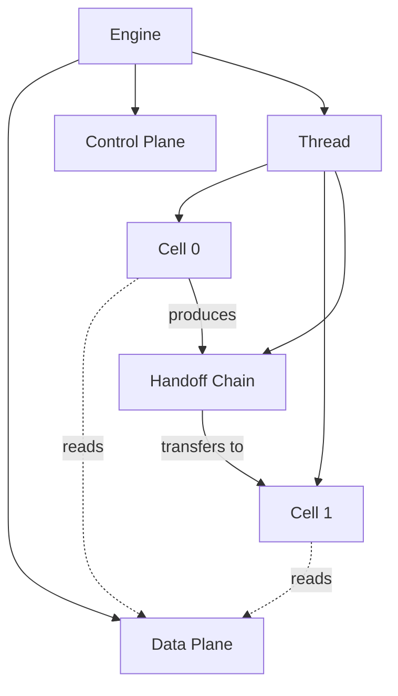
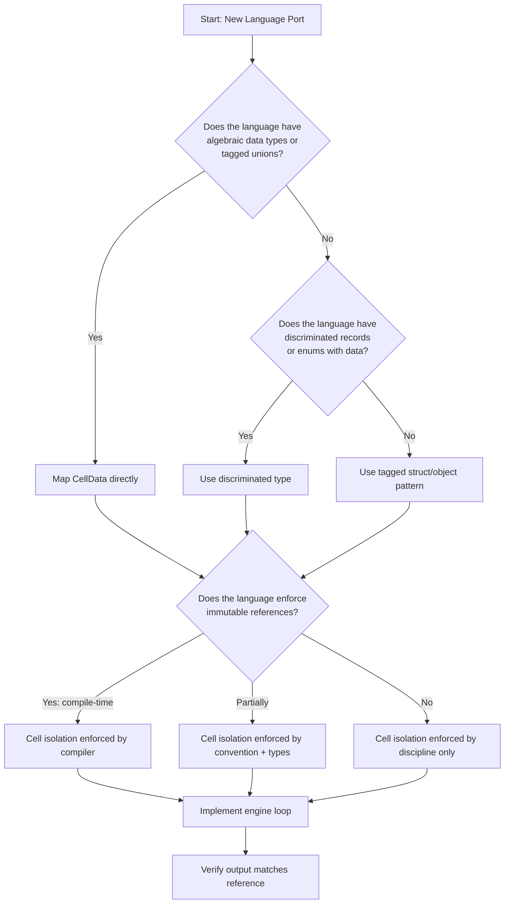
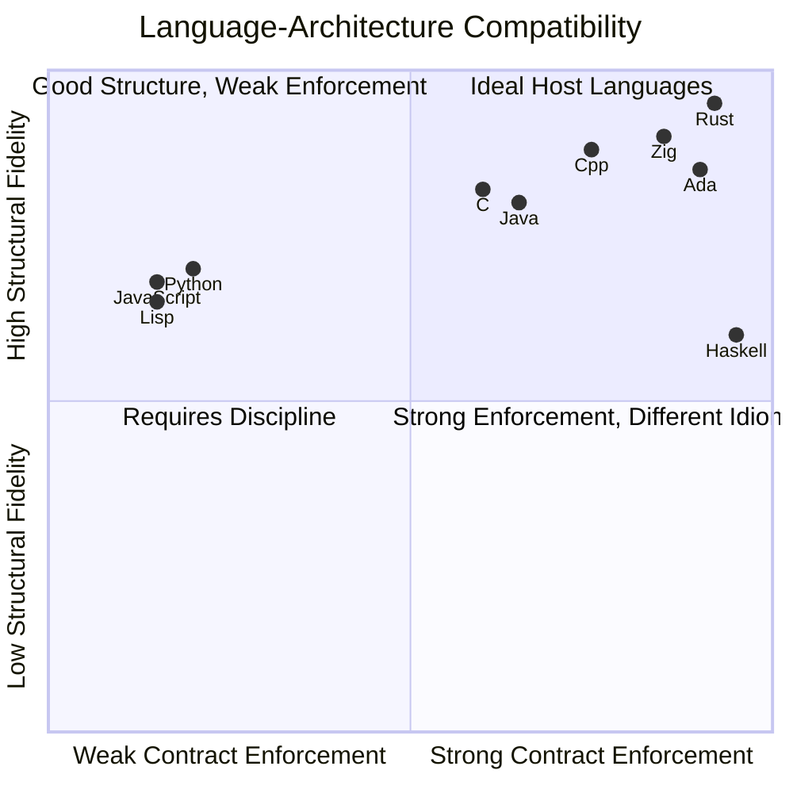
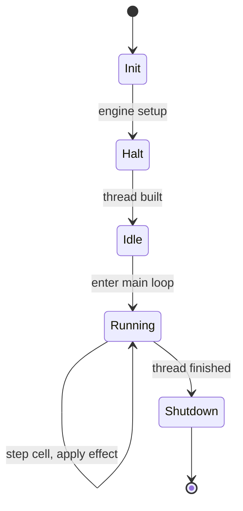
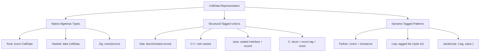
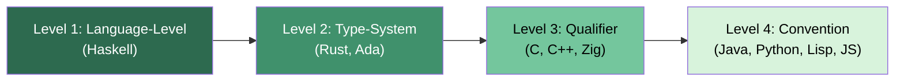
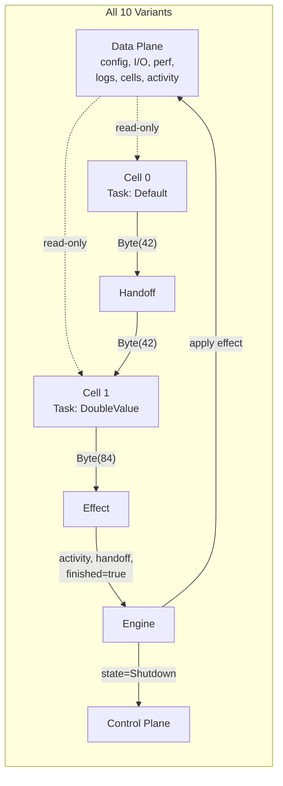
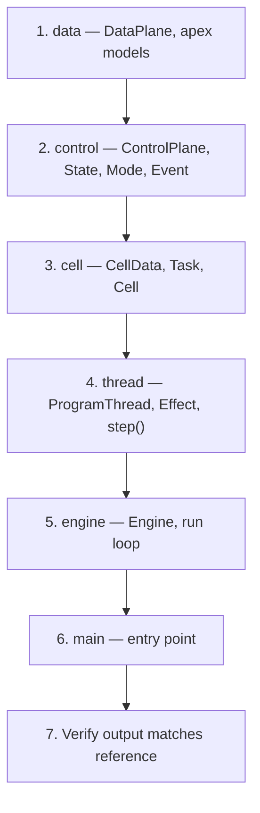

# Regulated Cell Architecture (RCA) - Cross-Language Variant Analysis

**Author:** Gavin Walters

**Date:** 2026-03-31

**Source Language:** Rust (edition 2024)

**Variant Languages:** C, C++, Python, Ada, Zig, Haskell, Common Lisp, JavaScript, Java

**Status:** All ten implementations verified — identical runtime behavior confirmed

---

## Table of Contents

1. [Introduction](#1-introduction)
2. [Architecture Portability Model](#2-architecture-portability-model)
3. [Variant Summaries](#3-variant-summaries)
4. [Language-Architecture Compatibility Matrix](#4-language-architecture-compatibility-matrix)
5. [Execution Reference](#5-execution-reference)
6. [Cross-Cutting Insights](#6-cross-cutting-insights)
7. [RCA Primitive Mapping Across Languages](#7-rca-primitive-mapping-across-languages)
8. [The Immutability Constraint Spectrum](#8-the-immutability-constraint-spectrum)
9. [Architectural Validation](#9-architectural-validation)
10. [Workflows for Future Ports](#10-workflows-for-future-ports)
11. [Conclusion](#11-conclusion)

---

## 1. Introduction

One of the foundational claims of Regulated Cell Architecture is that it is a **language-agnostic execution model**. The architecture is defined by a set of structural relationships and behavioral contracts — not by language-specific features. To validate this claim, the original Rust implementation was ported to nine additional languages spanning systems programming, high-assurance engineering, functional programming, dynamic scripting, and managed runtimes.

Every variant implements the same default pipeline: a two-cell thread where Cell 0 produces `Byte(42)` and Cell 1 doubles it to `Byte(84)`. The engine drives the same state machine transitions (`Init → Halt → Idle → Running → Shutdown`) and all ten implementations produce identical output.

This document analyzes how each language maps to RCA's primitives, what the porting process reveals about the architecture's design, and how future ports should be approached.

---

## 2. Architecture Portability Model

RCA's portability rests on five primitives and three contracts. Every language must express all five primitives and enforce all three contracts to be a valid implementation.

### 2.1 The Five Primitives



### 2.2 The Three Contracts

| Contract | Definition | What It Prevents |
|----------|-----------|-----------------|
| **Cell Isolation** | Cells receive context as read-only. They cannot mutate the Data Plane or Control Plane. | Hidden state mutations, unpredictable side effects |
| **Engine Authority** | Only the engine may apply returned effects to system state. | Distributed mutation, race conditions, untracked state changes |
| **Regulated Flow** | Execution proceeds through an explicit state machine. All transitions are visible. | Implicit control flow, hidden mode switches |

### 2.3 Porting Decision Flow



---

## 3. Variant Summaries

### 3.1 C Variant

**Directory:** `variants/c/`

**Language Characteristics:** Manual memory management, no type-level enforcement of immutability beyond `const`, procedural.

**RCA Mapping:**

| RCA Primitive | C Construct |
|---------------|-------------|
| CellData | Tagged union (`CellDataTag` enum + `union`) |
| DataPlane | `struct` with nested structs |
| ControlPlane | `struct` with enum fields |
| Cell | `struct` with `id` and `Task` enum |
| Engine Loop | `for(;;)` with `switch` on state |

**Key Observations:**
- The `const DataPlane *ctx` parameter enforces read-only access at the compiler level — the cell isolation contract is partially compiler-enforced.
- Tagged unions require manual tag management. Every `CellData` access must check the tag before reading the value. This is error-prone but explicit.
- The handoff transfer maps to a copy-then-reset pattern. C has no ownership model, so the "take" semantic is simulated.
- Fixed-size arrays (`Cell tasks[CELLS]`) mirror the Rust implementation's compile-time sizing directly.
- RCA's architecture aligns naturally with C's procedural model. The framework's explicit state and lack of hidden control flow are exactly what C programmers expect.

**Compatibility Rating:** Strong — C's explicitness matches RCA's philosophy. The lack of algebraic types is the primary friction point.

---

### 3.2 C++ Variant

**Directory:** `variants/cpp/`

**Language Characteristics:** Multi-paradigm, RAII, templates, `std::variant`, `std::optional`, move semantics.

**RCA Mapping:**

| RCA Primitive | C++ Construct |
|---------------|---------------|
| CellData | `std::variant<CellNone, CellByte>` |
| DataPlane | `struct` with default member initializers |
| ControlPlane | `struct` with `enum class` fields |
| Cell | `struct` with methods |
| Engine Loop | `for(;;)` with `switch` on `enum class` |

**Key Observations:**
- `std::variant` provides type-safe tagged unions with `std::get_if` for pattern matching — a significant improvement over C's manual tag management.
- `std::exchange` maps directly to `std::mem::take` for the handoff transfer.
- `std::optional` maps directly to `Option<T>` in `ProgramThread::build_tasks`.
- Default member initializers eliminate the need for separate `_default()` functions, reducing boilerplate compared to the C variant.
- `const DataPlane &ctx` enforces read-only access at the compiler level.
- Header-only modules (`data.hpp`, `control.hpp`) are possible because they define only types with inline defaults — no implementation files needed.

**Compatibility Rating:** Strong — C++ offers the closest feature mapping to Rust among the systems languages.

---

### 3.3 Python Variant

**Directory:** `variants/python/`

**Language Characteristics:** Dynamic typing, garbage collected, duck typing, `dataclass` support.

**RCA Mapping:**

| RCA Primitive | Python Construct |
|---------------|-----------------|
| CellData | `Union[CellNone, CellByte]` with `isinstance` checks |
| DataPlane | `@dataclass` |
| ControlPlane | `@dataclass` with `Enum` fields |
| Cell | `@dataclass` with methods |
| Engine Loop | `while True` with `if/elif` on state |

**Key Observations:**
- Python has no compile-time enforcement of the cell isolation contract. The `DataPlane` is passed as a regular argument — nothing prevents a cell from mutating it. This is discipline-only enforcement.
- `@dataclass` provides a concise struct-like syntax with default values and automatic `__init__`, mapping cleanly to Rust structs.
- `Union` types with `isinstance` checks simulate pattern matching but lack exhaustiveness checking.
- The handoff transfer is a simple reassignment — Python's garbage collector handles the rest. There is no ownership model to express.
- Zero external dependencies. The entire implementation uses only the Python standard library.
- Despite the lack of enforcement, the architecture's structure still provides value. The separation of concerns and explicit state machine are organizational benefits regardless of whether the compiler polices them.

**Compatibility Rating:** Moderate — the architecture maps structurally, but the core isolation contract relies entirely on developer discipline.

---

### 3.4 Ada Variant

**Directory:** `variants/ada/`

**Language Characteristics:** Strong static typing, `in`/`out`/`in out` parameter modes, discriminated records, designed for high-assurance systems.

**RCA Mapping:**

| RCA Primitive | Ada Construct |
|---------------|---------------|
| CellData | Discriminated record (`Cell_Data` with `Tag : Cell_Data_Tag`) |
| DataPlane | Record with default field values |
| ControlPlane | Record with enumeration fields |
| Cell | Record with `The_Task` enumeration field |
| Engine Loop | `loop` with `case` on state |

**Key Observations:**
- Ada's `in` parameter mode is the strongest compile-time enforcement of the cell isolation contract across all ten variants. When `Ctx` is declared `in Data_Plane`, the compiler rejects any attempt to modify it — no `const` keyword, no borrow checker, just a parameter mode declaration.
- Discriminated records are Ada's native tagged union. The `Cell_Data` record uses a discriminant `Tag : Cell_Data_Tag` with variant-specific fields in a `case` block. This is structurally identical to Rust's enum-with-data.
- Reserved words required renaming: `Body` → `Content`, `Task` → `The_Task`. Ada's reserved word list is larger than most languages, and identifiers that are common in other languages can collide.
- The `Mode` type conflicted with `Ada.Text_IO.Mode` due to `use` clauses pulling both into scope. This required fully qualifying as `RCA.Control.Mode`.
- Ada's package system (`.ads` spec + `.adb` body) maps naturally to the Rust module pattern of defining public interfaces and private implementations.
- SPARK/Ada subset could be used to formally verify properties of the state machine transitions, making Ada potentially the strongest variant for high-assurance RCA deployments.

**Compatibility Rating:** Excellent — Ada is arguably the most natural host for RCA outside of Rust. The language was designed for the exact problem domain RCA targets.

---

### 3.5 Zig Variant

**Directory:** `variants/zig/`

**Language Characteristics:** Compile-time evaluation, explicit allocation, no hidden control flow, tagged unions, `comptime`.

**RCA Mapping:**

| RCA Primitive | Zig Construct |
|---------------|---------------|
| CellData | `union(enum)` (tagged union) |
| DataPlane | `struct` with default field values |
| ControlPlane | `struct` with `enum` fields |
| Cell | `struct` with methods |
| Engine Loop | `while (true)` with `switch` on state |

**Key Observations:**
- Zig's `union(enum)` is a first-class tagged union with compiler-enforced exhaustive `switch` — very close to Rust's enum model.
- `*const DataPlane` enforces read-only access at the compiler level, directly analogous to Rust's `&DataPlane`.
- Struct field defaults (`count: usize = 0`) handle what Rust does with the `Default` trait, with zero boilerplate.
- The handoff transfer is a simple assignment plus reset. Zig has no drop semantics or RAII, so the "take" pattern is trivially expressed.
- Wrapping arithmetic (`+%`) was used for the `DoubleValue` task to match Rust's wrapping behavior on `u8`.
- Zig's "no hidden control flow" philosophy aligns perfectly with RCA's core principle that execution should be explicit and observable.
- Zig 0.15's I/O API changes required using `std.debug.print` (writes to stderr) instead of the previous `std.io.getStdOut().writer()` pattern. This is a reminder that Zig is pre-1.0 and API stability is not guaranteed.

**Compatibility Rating:** Excellent — Zig's design philosophy and RCA's design philosophy are nearly identical. The language enforces the same properties RCA demands.

---

### 3.6 Haskell Variant

**Directory:** `variants/haskell/`

**Language Characteristics:** Purely functional, lazy evaluation, algebraic data types, pattern matching, monadic I/O.

**RCA Mapping:**

| RCA Primitive | Haskell Construct |
|---------------|-------------------|
| CellData | Algebraic data type (`CellNone \| CellByte Int`) |
| DataPlane | Record type with named fields |
| ControlPlane | Record type with ADT fields |
| Cell | Record type, `cellExecute` as pure function |
| Engine Loop | Tail-recursive `engineLoop` in `IO` monad |

**Key Observations:**
- Haskell enforces the cell isolation contract by default. Immutability is not a feature — it is the absence of mutability. There is no way for a cell to mutate the `DataPlane` because values cannot be mutated. The contract is enforced at the language level without any explicit annotation.
- The `step` function is pure: `step :: ProgramThread -> DataPlane -> (ProgramThread, Effect)`. It takes immutable state and returns new state. No `IO`, no side effects, no hidden mutations. This is the strongest enforcement of cell isolation of any variant — even stronger than Ada's `in` mode, because Ada still allows mutation through other parameters.
- The engine loop is a tail-recursive function `engineLoop :: Engine -> ProgramThread -> IO ()` rather than a `for`/`while` loop. Each iteration produces a new `Engine` value via record update syntax. The old value is simply unreferenced.
- The `IO` monad appears only at the engine level for printing — exactly where RCA says side effects should live. The architecture's layering (pure cells, effectful engine) maps directly to Haskell's type-level separation of pure and effectful code.
- Algebraic data types are Haskell's native representation for tagged unions. `data CellData = CellNone | CellByte Int` is the most concise and natural CellData definition across all variants.
- Record update syntax (`engine { engCtl = ... }`) is more verbose than mutation but makes every state change explicit and traceable.

**Compatibility Rating:** Strong, with caveats — Haskell naturally enforces RCA's contracts, but the resulting code is structurally different from the imperative variants. The architecture translates, but the idiom shifts from "loop with state mutation" to "recursive function with state threading."

---

### 3.7 Common Lisp Variant

**Directory:** `variants/lisp/`

**Language Characteristics:** Dynamic typing, homoiconicity, macros, CLOS, multi-paradigm, image-based development.

**RCA Mapping:**

| RCA Primitive | Common Lisp Construct |
|---------------|----------------------|
| CellData | Tagged lists (`(:none)`, `(:byte 42)`) |
| DataPlane | `defstruct` with typed defaults |
| ControlPlane | `defstruct` with keyword symbol fields |
| Cell | `defstruct`, `cell-execute` as function |
| Engine Loop | `loop` macro with `ecase` on state |

**Key Observations:**
- Keyword symbols (`:init`, `:running`, `:debug`) provide a natural enum representation. No type definition is needed — symbols are self-evaluating and self-documenting.
- `ecase` (exhaustive case) signals a runtime error if an unexpected value appears, providing a dynamic equivalent of Rust's exhaustive `match`. This is the closest thing Common Lisp offers to compile-time exhaustiveness checking.
- `defstruct` generates constructors, accessors, and copiers automatically, mapping cleanly to Rust structs with less boilerplate.
- Tagged lists (`(:byte 42)`) are the lightest-weight tagged union across all variants. No type definition, no struct, no enum — just a list with a keyword tag. This is maximally flexible but provides no compile-time safety.
- Cell isolation is discipline-only. `defstruct` fields are mutable by default, and nothing prevents a cell from calling `setf` on the `DataPlane`.
- `multiple-value-bind` for `thread-step` provides a clean way to return both the updated thread and the effect without creating a wrapper type — analogous to Rust's tuple returns.
- The `load`-based module system in `main.lisp` is simple but lacks the dependency management of other variants. A production deployment would use ASDF (Another System Definition Facility).

**Compatibility Rating:** Moderate — the architecture maps structurally, and Lisp's flexibility makes the port straightforward, but there is no enforcement of isolation contracts. The dynamic nature means errors that other variants catch at compile time become runtime errors.

---

### 3.8 JavaScript Variant

**Directory:** `variants/javascript/`

**Language Characteristics:** Dynamic typing, prototype-based OOP, first-class functions, event loop (unused here), garbage collected.

**RCA Mapping:**

| RCA Primitive | JavaScript Construct |
|---------------|---------------------|
| CellData | Tagged objects (`{ tag: "byte", value: 42 }`) |
| DataPlane | Plain object via factory function |
| ControlPlane | Plain object with `Object.freeze` enum constants |
| Cell | Plain object, `cellExecute` as function |
| Engine Loop | `for(;;)` with `switch` on state |

**Key Observations:**
- `Object.freeze` provides immutable enum-like constants for `State`, `Mode`, and `Event`. This is the closest JavaScript can get to compile-time constant enums.
- Tagged objects (`{ tag: "byte", value: 42 }`) with factory functions (`cellNone()`, `cellByte(v)`) simulate algebraic types. There is no exhaustiveness checking.
- Cell isolation is discipline-only. Objects are passed by reference, and nothing prevents a cell from mutating the `DataPlane`.
- CommonJS `require`/`module.exports` provides a straightforward module system mapping to Rust's `mod`/`use`.
- Byte masking (`& 0xFF`) is needed in the `DoubleValue` task because JavaScript numbers are IEEE 754 doubles — there is no native `u8` type.
- No external dependencies. The implementation uses only Node.js built-in modules.
- The lack of static typing means the "typed slot map" nature of the `DataPlane` — one of RCA's structural guarantees — is not enforced. Fields can hold any value.

**Compatibility Rating:** Moderate — the architecture maps structurally, but JavaScript's dynamic nature means most of RCA's compile-time guarantees become runtime conventions.

---

### 3.9 Java Variant

**Directory:** `variants/java/`

**Language Characteristics:** Statically typed, managed runtime, class-based OOP, garbage collected. Java 21 features: records, sealed interfaces, pattern matching in `switch`.

**RCA Mapping:**

| RCA Primitive | Java Construct |
|---------------|----------------|
| CellData | `sealed interface` + `record` variants |
| DataPlane | Class with package-visible mutable fields |
| ControlPlane | Class with `enum` fields |
| Cell | Class with `enum Task` containing `access()` method |
| Engine Loop | `while(true)` with enhanced `switch` on `enum` |

**Key Observations:**
- Java 21's `sealed interface` + `record` is the most structurally faithful mapping to Rust's enum-with-data outside of languages with native algebraic types. `sealed interface CellData { record None()..., record Byte(int value)... }` provides exhaustive pattern matching in `switch` statements.
- `record` types (for `CellInfo`, `ActivityInfo`, `Effect`) are immutable value types with automatic accessors — direct analogs to Rust's tuple structs.
- Java's `switch` with pattern matching (`case CellData.Byte b ->`) provides compile-time exhaustiveness checking on sealed types.
- `Thread` is a reserved class name in `java.lang`, requiring the RCA Thread to be named `RcaThread` — analogous to the Ada reserved word issue.
- The `Task` enum's `access()` method places task behavior directly on the enum variant, which is a clean Java-idiomatic mapping of Rust's `Task::access_task()` match arms.
- Cell isolation is partially enforced. The `Data` class uses package-visible fields, and cells within the same package could technically mutate the `DataPlane`. Full enforcement would require passing an immutable view or interface.

**Compatibility Rating:** Strong — Java 21's modern features (sealed interfaces, records, pattern matching) provide a surprisingly clean mapping. The ceremony overhead is higher than most variants, but the type safety is competitive.

---

## 4. Language-Architecture Compatibility Matrix



### 4.1 Compatibility Summary Table

| Language | Cell Isolation Enforcement | CellData Mapping | Structural Fidelity | Overall Rating |
|----------|---------------------------|------------------|---------------------|----------------|
| **Rust** | Compile-time (borrow checker) | Native enum | Reference implementation | Reference |
| **Ada** | Compile-time (`in` mode) | Discriminated record | Excellent | Excellent |
| **Zig** | Compile-time (`*const`) | Tagged `union(enum)` | Excellent | Excellent |
| **C++** | Compile-time (`const &`) | `std::variant` | Strong | Strong |
| **Haskell** | Language-level (immutability) | Algebraic data type | Different idiom | Strong |
| **Java** | Partial (package visibility) | Sealed interface + record | Strong | Strong |
| **C** | Compile-time (`const *`) | Manual tagged union | Strong | Strong |
| **Python** | Discipline only | `Union` + `isinstance` | Moderate | Moderate |
| **Common Lisp** | Discipline only | Tagged list | Moderate | Moderate |
| **JavaScript** | Discipline only | Tagged object | Moderate | Moderate |

---

## 5. Execution Reference

### 5.1 Build and Run Commands

| Language | Build | Run | Prerequisites |
|----------|-------|-----|---------------|
| **Rust** | `cargo build` | `cargo run` | `rustc`, `cargo` |
| **C** | `make` | `./rca_run` | `gcc` |
| **C++** | `make` | `./rca_run` | `g++` |
| **Python** | — | `python3 main.py` | `python3` |
| **Ada** | `gprbuild -P rca.gpr` | `./main` | `gnat`, `gprbuild` |
| **Zig** | `zig build` | `zig build run` | `zig` |
| **Haskell** | `cabal build` | `cabal run rca-run` | `ghc`, `cabal` |
| **Common Lisp** | — | `sbcl --script main.lisp` | `sbcl` |
| **JavaScript** | — | `node main.js` | `node` |
| **Java** | `make` | `make run` | `javac`, `java` (21+) |

### 5.2 Expected Output (All Variants)

All ten implementations produce the following output (formatting variations such as leading spaces in Ada's `Natural'Image` are noted but do not affect semantic equivalence):

```
>>>
  Control:
    state: Init
    mode:  Debug

  Data:
    cells.count: 2
    activity:    ""

>>>
  Control:
    state: Halt
    mode:  Debug
  ...
>>>
  Control:
    state: Running
    mode:  Debug

  Effect:
    Byte(42)

  Data:
    cells.count: 2
    activity:    "Default"
<<<
>>>
  Control:
    state: Running
    mode:  Debug

  Effect:
    Byte(84)

  Data:
    cells.count: 2
    activity:    "DoubleValue"
<<<
>>>
  Control:
    state: Shutdown
    mode:  Debug

  Data:
    cells.count: 2
    activity:    ""
```

### 5.3 State Machine Execution Sequence



---

## 6. Cross-Cutting Insights

### 6.1 The Architecture Survived Translation

The most significant finding is that none of the ten ports required rethinking the architecture. Every language could express all five primitives and all three contracts. The implementation details varied — tagged unions vs. algebraic types vs. tagged objects — but the structure remained isomorphic. This is strong empirical evidence that RCA is genuinely language-agnostic.

### 6.2 The CellData Problem Is Universal

Every language had to solve the same problem: how to represent a typed union of possible inter-cell data. The solutions fell into three categories:



The native algebraic type languages required zero boilerplate to express CellData. The structural languages required explicit type definitions but provided compile-time safety. The dynamic languages required the least code but provided no compile-time guarantees.

### 6.3 The Immutability Contract Is the Differentiator

The single most important property that separates variant quality is how well the language enforces the cell isolation contract (cells cannot mutate the Data Plane). This is not a stylistic preference — it is the invariant that gives RCA its determinism and traceability guarantees. A variant that cannot enforce this contract is architecturally valid but operationally weaker.

### 6.4 Reserved Words Revealed Naming Assumptions

Both Ada and Java exposed naming collisions:

| Language | Collision | Resolution |
|----------|-----------|------------|
| Ada | `Body` (reserved word) | Renamed to `Content` |
| Ada | `Task` (reserved word) | Renamed to `The_Task` |
| Ada | `Mode` (clashed with `Ada.Text_IO.Mode`) | Fully qualified as `RCA.Control.Mode` |
| Java | `Thread` (clashed with `java.lang.Thread`) | Renamed to `RcaThread` |

This suggests that future ports should audit RCA's identifier names against the target language's reserved words and standard library namespaces before beginning implementation.

### 6.5 The Engine Loop Has Two Natural Forms

The engine's main loop expressed itself in two fundamentally different patterns across the variants:

**Imperative loop with mutable state** (Rust, C, C++, Python, Ada, Zig, Common Lisp, JavaScript, Java):
```
while (true) {
    match state {
        Running => { mutate state in place }
        _ => { shutdown }
    }
}
```

**Tail-recursive function with immutable state** (Haskell):
```
engineLoop engine thread =
    case state of
        Running -> engineLoop engine' thread'
        _       -> shutdown
```

Both forms are semantically identical. The existence of the recursive form validates that RCA's execution model is not inherently imperative — it can be expressed purely functionally. The architecture describes a state machine, not a mutation strategy.

### 6.6 The Handoff Mechanism Is Simpler Than It Appears

In Rust, the handoff transfer uses `std::mem::take` — an ownership-aware operation that moves the value and replaces it with a default. This raised the question: would this pattern be difficult to express in languages without ownership semantics?

The answer is no. In every other language, the handoff transfer reduced to:

1. Copy (or reference) the current handoff
2. Reset the handoff slot to a default
3. Pass the copy to the cell
4. Store the cell's return value as the new handoff

The ownership semantics in Rust formalize something that is conceptually straightforward. The `std::mem::take` call is an optimization and a safety guarantee, not a complexity requirement.

---

## 7. RCA Primitive Mapping Across Languages

### 7.1 Complete Mapping Table

| RCA Primitive | Rust | C | C++ | Python | Ada | Zig | Haskell | Lisp | JavaScript | Java |
|---------------|------|---|-----|--------|-----|-----|---------|------|-----------|------|
| **CellData** | `enum` | tagged union | `std::variant` | `Union` | discriminated record | `union(enum)` | ADT | tagged list | tagged object | sealed interface |
| **DataPlane** | `struct` | `struct` | `struct` | `@dataclass` | `record` | `struct` | record type | `defstruct` | factory function | class |
| **ControlPlane** | `struct` + enums | `struct` + enums | `struct` + `enum class` | `@dataclass` + `Enum` | `record` + enums | `struct` + enums | record + ADTs | `defstruct` + keywords | object + `Object.freeze` | class + enums |
| **Cell.execute** | `&mut self, &ctx, handoff` | `Cell*, const ctx*, handoff` | `Cell&, const ctx&, handoff` | `self, ctx, handoff` | `in out Cell, in ctx, handoff` | `*Cell, *const ctx, handoff` | `Cell -> ctx -> handoff -> CellData` | `cell ctx handoff` | `cell, ctx, handoff` | `this, ctx, handoff` |
| **Engine Loop** | `loop { match }` | `for(;;) switch` | `for(;;) switch` | `while True: if` | `loop case` | `while switch` | tail recursion | `loop ecase` | `for(;;) switch` | `while(true) switch` |
| **Module System** | `mod` / `use` | headers + `.c` | headers + `.cpp` | packages + `import` | child packages `.ads`/`.adb` | `@import` | modules + `import` | `defpackage` + `load` | `require`/`exports` | `package` + `import` |
| **Error Handling** | `Result<T, E>` | `int` return code | `int` return code | exceptions | exceptions | `!void` error union | `Either` / `IO` | conditions | exceptions | exceptions |

---

## 8. The Immutability Constraint Spectrum

The cell isolation contract is enforced at different levels across the variants. This spectrum directly affects the reliability of the guarantee:



| Level | Enforcement | Languages | What Can Go Wrong |
|-------|-------------|-----------|-------------------|
| **Level 1** | Immutability is the default; mutation requires explicit opt-in | Haskell | Nothing — violation is a type error |
| **Level 2** | Type system prevents mutation via borrow rules or parameter modes | Rust, Ada | Nothing — violation is a compile error |
| **Level 3** | `const`/`*const` qualifiers prevent mutation through that reference | C, C++, Zig | Cast-away-const is possible but requires deliberate circumvention |
| **Level 4** | No enforcement; isolation is maintained by developer discipline | Java, Python, Lisp, JS | Accidental mutation is silent and undetected |

---

## 9. Architectural Validation

### 9.1 What the Porting Process Proves

The successful port to ten languages validates several claims from the RCA design:

1. **Language-agnostic execution model.** The five primitives and three contracts are expressible in systems languages, functional languages, dynamic languages, and managed runtimes. No language required architectural modifications.

2. **Separation of concerns is structural, not syntactic.** The Data Plane / Control Plane / Cell / Thread / Engine separation is not a Rust idiom — it is a structural property that every language can represent.

3. **The architecture is minimal.** No variant required adding concepts that the Rust implementation lacked. The five primitives are sufficient.

4. **Extension points translate.** The FREEZE/MUTABLE annotation pattern (where to add new tasks, data types, thread variants) was clear in every language. A developer in any of the ten languages can identify where to extend the framework.

### 9.2 What the Porting Process Reveals

1. **The architecture favors statically-typed languages.** While all ten variants work, the statically-typed variants (Rust, Ada, Zig, C++, C, Java, Haskell) provide compile-time enforcement of at least some contracts. The dynamically-typed variants (Python, Common Lisp, JavaScript) rely entirely on discipline.

2. **Algebraic data types are the ideal CellData representation.** Languages with native ADTs (Rust, Haskell, Zig) express CellData with zero boilerplate and full safety. Every other language requires some workaround.

3. **The fixed-size cell array is a portability constraint.** The `CELLS` constant determining array size at compile time works in Rust, C, C++, Zig, and Ada. In Python, Haskell, Common Lisp, JavaScript, and Java, the "array" is a dynamically-sized list or heap-allocated array. This is the one primitive that does not translate uniformly.

### 9.3 Cross-Language Data Flow



---

## 10. Workflows for Future Ports

### 10.1 Porting Checklist

When porting RCA to a new language, follow this sequence:

1. **Audit identifiers.** Check `Body`, `Task`, `Thread`, `State`, `Mode`, `Event`, `Cell`, `Engine` against the target language's reserved words and standard library names.

2. **Choose the CellData representation.** Identify the language's closest equivalent to a tagged union (see Section 6.2). This decision will cascade through the entire implementation.

3. **Implement bottom-up:** Data Plane → Control Plane → Cell → Thread → Engine → Main.

4. **Verify the cell isolation contract.** Determine how the language enforces (or fails to enforce) read-only access to the Data Plane from within cells. Document the enforcement level.

5. **Implement the handoff transfer.** Map the copy-reset-execute-store pattern (see Section 6.6) to the language's value/reference semantics.

6. **Run and compare output.** The reference output in Section 5.2 is the acceptance test. Semantic equivalence is required; minor formatting variations (leading spaces, quote styles) are acceptable.

### 10.2 Implementation Order



### 10.3 Candidate Languages for Future Ports

Based on the insights from the current ten variants, the following languages are strong candidates for future ports:

| Language | Expected Compatibility | Rationale |
|----------|----------------------|-----------|
| **Go** | Strong | Structs, interfaces, explicit error handling. Channels could provide an alternative handoff mechanism. |
| **Forth** | Strong | Stack-based handoff is a natural fit. Deterministic, used in embedded/aerospace. |
| **Erlang/Elixir** | Strong | Actor model ancestry, pattern matching, immutable data. |
| **Nim** | Strong | Algebraic types, systems focus, compiles to C. |
| **Kotlin** | Strong | Sealed classes, data classes, when-expressions. |
| **Swift** | Strong | Enums with associated values, value types, protocol-oriented. |
| **OCaml** | Excellent | Algebraic types, pattern matching, strong type system. |
| **VHDL/SystemVerilog** | Experimental | Would bridge the software-hardware gap described in the RCA vision. |

---

## 11. Conclusion

The cross-language porting exercise demonstrates that Regulated Cell Architecture is not a Rust framework — it is an execution model that Rust happens to express well. The five primitives (DataPlane, ControlPlane, Cell, Thread, Engine) and three contracts (cell isolation, engine authority, regulated flow) are language-independent concepts that every tested language could represent.

The variants exist on a spectrum of enforcement. At one end, Haskell and Ada enforce RCA's contracts at the language or type-system level — violations are compilation errors. At the other end, Python, Common Lisp, and JavaScript rely on developer discipline — violations are silent. The architecture provides value at every point on this spectrum, but its guarantees are strongest in languages that can enforce its contracts.

The fact that ten languages with fundamentally different paradigms — imperative, functional, object-oriented, dynamic, systems-level — all produced semantically identical output from the same architectural blueprint is the strongest possible validation of RCA's claim to be a portable execution model.

---

*This analysis was produced through systematic porting of the reference Rust implementation. All ten variants are maintained in the `variants/` directory of this repository.*
